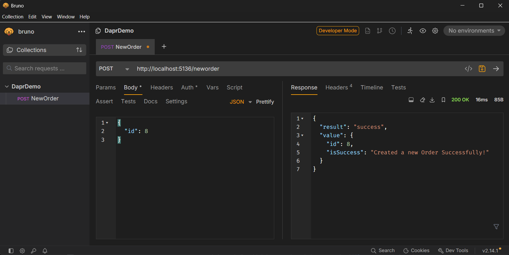
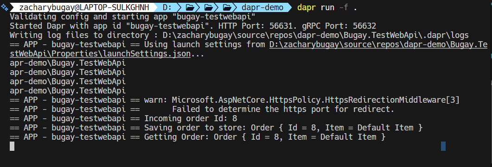

# Dapr Demo

This repository demonstrates how simple it is to get up and running with Dapr.

## Setup

1. Build the application
    `dotnet build .`
2. Run Redis
    `docker run -p 6379:6379 --name dapr-redis-demo redis`
3. Run Dapr
    `dapr run -f .`

Thats all there is to it!

## Add Test Data

I've opted to use Bruno, but feel free to use whatever Http client you'd like. Make some post commands to generate some data.



Review the logs as you run your Http Post commands



## Reviewing Dapr

The `dapr.yaml` file is the configuration file that ties everything together.

```yaml
version: 1
common:
  resourcesPath: ./resources
apps:
  - appID: bugay-testwebapi
    appDirPath: ./Bugay.TestWebApi
    command: ["dotnet", "run"] 
```

The `./resources/statestore.yaml` defines the connection to our Redis cache. This instructs Dapr to run redis as a side car. If you take a look at your docker desktop, you'll find not only the image redis up and running, but the other dapr sidecars.

```yaml
apiVersion: dapr.io/v1alpha1
kind: Component
metadata:
  name: statestore
spec:
  type: state.redis
  version: v1
  metadata:
  - name: redisHost
    value: localhost:6379
  - name: redisPassword
    value: ""
  - name: actorStateStore
    value: "true"
```
